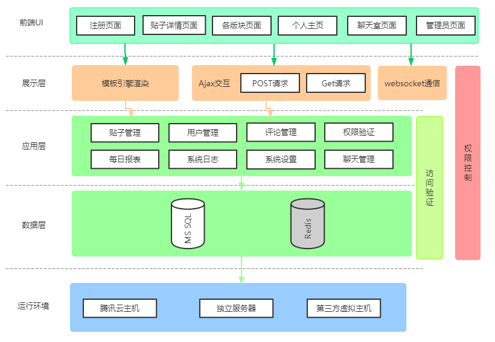

# CCSU_BBS
## 项目概述

基于django实现的长沙学院校园论坛

前端: uikit

后端: django技术栈

数据库: mysql, redis

系统架构图:

## 开发日志

**2021.01.05** 项目创立, 设计系统架构图

**2021.01.11** 设计各个功能的数据库模型

**2021.01.30** 完成各个字段的创建，完成数据库迁移。搭建了app_user的基本框架,实现jwt鉴权的中间件与对应函数